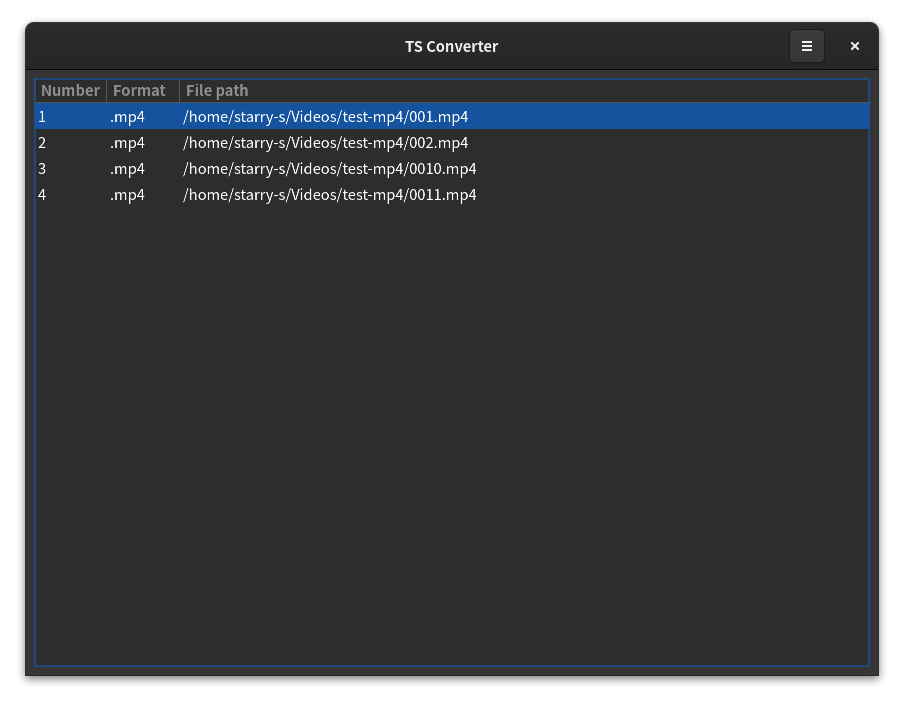
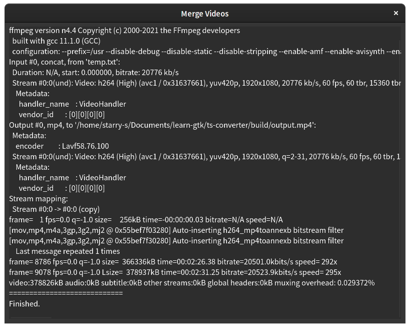

# TS Converter

A simple GUI application for combine (concatenate) multiple video clips.

# Dependencies

- GTK4
- ffmpeg (Command line)

# Usage

For Linux Users:

Install `meson`, `gtk4` dependencies and build tools(`gcc`) first.

And make sure you have installed [ffmpeg](https://www.ffmpeg.org/). 

```
$ git clone git@github.com:STARRY-S/ts-converter.git
$ cd ts-converter
$ meson build && cd build && meson compile
$ ./converter
```

For Windows Users:

> Still working in progress.

-----

# Screenshot





-----

# Others

> License: Apache 2.0
